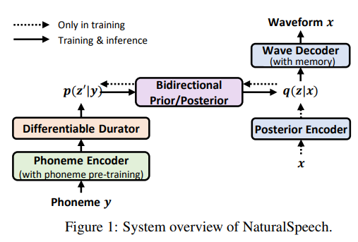

# NaturalSpeech: End-to-End Text to Speech Synthesis with Human-Level Quality

This is an implementation of Microsoft's [NaturalSpeech: End-to-End Text to Speech Synthesis with Human-Level Quality](https://arxiv.org/abs/2205.04421) in Pytorch.

Contribution and pull requests are highly appreciated!

23.02.01: Pretrained models or demo samples will soon be released.


### Overview



Naturalspeech is a VAE-based model that employs several techniques to improve the prior and simplify the posterior. It differs from VITS in several ways, including:
- **Phoneme pre-training**: Naturalspeech uses a pre-trained phoneme encoder on a large text corpus, obtained through masked language modeling on phoneme sequences.
- **Differentiable durator**: The posterior operates at the frame level, while the prior operates at the phoneme level. Naturalspeech uses a differentiable durator to bridge the length difference, resulting in soft and flexible features that are expanded.
- **Bidirectional Prior/Posterior**: Naturalspeech reduces the posterior and enhances the prior through normalizing flow, which maps in both directions with forward and backward loss.
- **Memory-based VAE**: The prior is further enhanced through a memory bank using Q-K-V attention."


### Notes
1. Phoneme pre-training with large-scale text corpus from the news-crawl dataset is omitted in this implementation.
2. Multiplier for each loss is denoted and can be adjusted in config, as using losses with no multiplier doesn't seem to converge.
3. Tuning stage for last 2k epochs is omitted.
4. As soft-dtw loss uses quite a lot of VRAM, there is an option for using non-softdtw loss.
5. For soft-dtw loss, warp is set to 134.4(=0.07 * 192), not 0.07, to match with non-softdtw loss.
6. To train the duration predictor in the warmup stage, duration labels are needed. As stated in the paper, you can choose any tools to provide duration label. Here I used pretrained VITS model. 
7. For memory efficient training, partial sequences are fed to decoder as in VITS.


### How to train

0.
    ```
    # python >= 3.6
    pip install -r requirements.txt
    ```

1. clone this repository
1. download `The LJ Speech Dataset`: [link](https://keithito.com/LJ-Speech-Dataset/)
1. create symbolic link to ljspeech dataset: 
    ```
    ln -s /path/to/LJSpeech-1.1/wavs/ DUMMY1
    ```
1. text preprocessing (optional, if you are using custom dataset):
    1. `apt-get install espeak`
    2. 
        ```
        python preprocess.py --text_index 1 --filelists filelists/ljs_audio_text_train_filelist.txt filelists/ljs_audio_text_val_filelist.txt filelists/ljs_audio_text_test_filelist.txt
        ```

1. duration preprocessing (obtain duration labels using pretrained VITS):
    1. `git clone https://github.com/jaywalnut310/vits.git; cd vits`
    2. create symbolic link to ljspeech dataset 
        ```
        ln -s /path/to/LJSpeech-1.1/wavs/ DUMMY1
        ```
    3. download pretrained VITS model described as from VITS official github: [github link](https://github.com/jaywalnut310/vits) / [pretrained models](https://drive.google.com/drive/folders/1ksarh-cJf3F5eKJjLVWY0X1j1qsQqiS2)
    4. setup monotonic alignment search (for VITS inference): 
        ```
        cd monotonic_align; mkdir monotonic_align; python setup.py build_ext --inplace; cd ..
        ```
    5. copy duration preprocessing script to VITS repo: `cp /path/to/naturalspeech/preprocess_durations.py .`
    6. 
        ```
        python3 preprocess_durations.py --weights_path ./pretrained_ljs.pth --filelists filelists/ljs_audio_text_train_filelist.txt.cleaned filelists/ljs_audio_text_val_filelist.txt.cleaned filelists/ljs_audio_text_test_filelist.txt.cleaned
        ```
    7. once the duration labels are created, copy the labels to the naturalspeech repo: `cp -r durations/ path/to/naturalspeech`

1. train (warmup)
    ```
    python3 train.py -c configs/ljs.json -m [run_name] --warmup
    ```
    Note here that ljs.json is for low-resource training, which runs for 1500 epochs and does not use soft-dtw loss. If you want to reproduce the steps stated in the paper, use ljs_reproduce.json, which runs for 15000 epochs and uses soft-dtw loss.

1. initialize and attach memory bank after warmup:
    ```
      python3 attach_memory_bank.py -c configs/ljs.json --weights_path logs/[run_name]/G_xxx.pth
    ```
    if you lack memory, you can specify the "--num_samples" argument to use only a subset of samples.

1. train (resume)
    ```
      python3 train.py -c configs/ljs.json -m [run_name]
    ```

You can use tensorboard to monitor the training.
```
tensorboard --logdir /path/to/naturalspeech/logs
```

During each evaluation phase, a selection of samples from the test set is evaluated and saved in the `logs/[run_name]/eval` directory.


## References
- [VITS implemetation](https://github.com/jaywalnut310/vits) by @jaywalnut310 for normalizing flows, phoneme encoder, and hifi-gan decoder implementation
- [Parallel Tacotron 2 Implementation](https://github.com/keonlee9420/Parallel-Tacotron2) by @keonlee9420 for learnable upsampling Layer
- [soft-dtw implementation](https://github.com/Maghoumi/pytorch-softdtw-cuda) by @Maghoumi for sdtw loss
